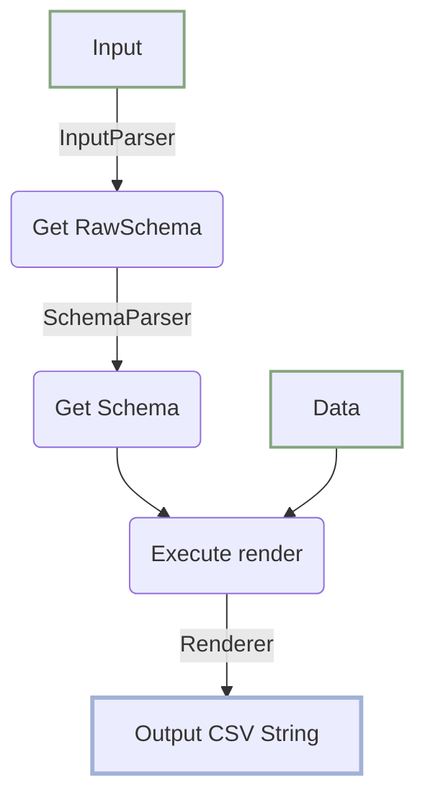

# CSV-Templator

A easy CSV template render using 2D table to implement your own code logic

## Pain point

- Coding of CSV importer/exporter is tedious.
- Schemas of CSV importer/exporter are hard to read and maintain
- Render(format) logic, data adjustment logic, and business logic all mix together

---

# Develop Guide

Internal flow

